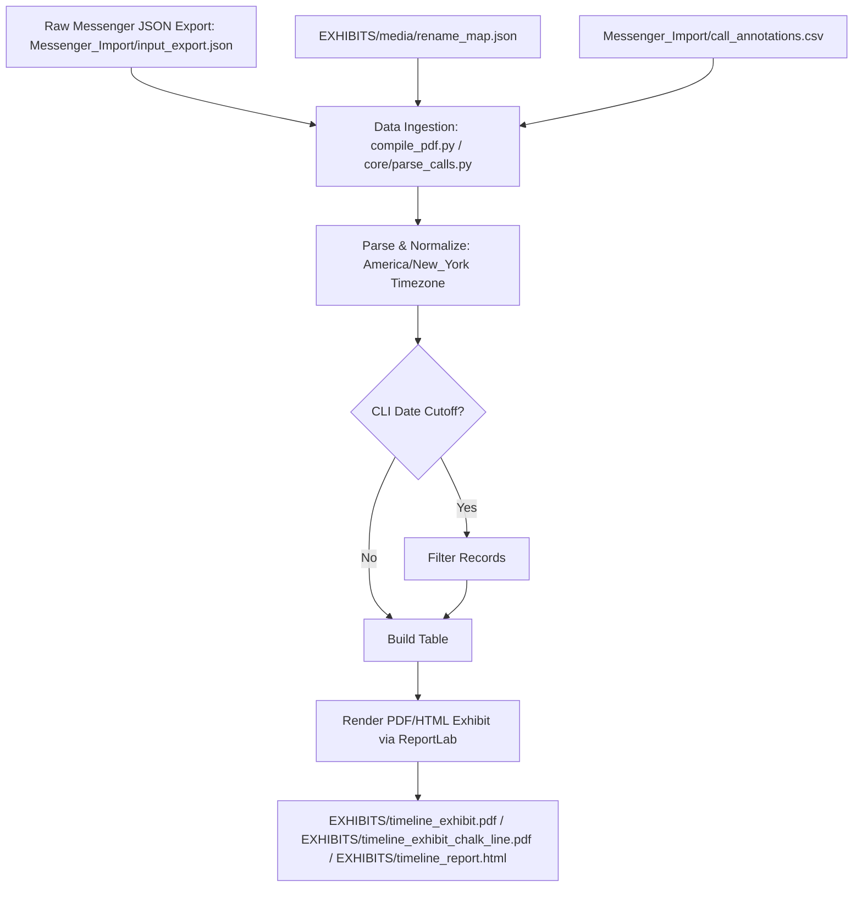

# MessengerMapper

An advanced, forensic-grade layout engine purpose-built to parse end-to-end encrypted Facebook Messenger export logs and transform high-density chat metadata into clear, courtroom-ready visual timelines.

Built with **Python**, **ReportLab**, and a zero-grid layout matrix, **MessengerMapper** eliminates manual timeline generation, structures disparate text/media records, and applies dynamic typographic scaling to spotlight critical communication events like connected and unanswered video calls.

---

## 🎨 Core Visual & Logic Specifications

### 1. HTML Layout System & Interface
* **3-Column Grid Layout Engine**: Implements a strict **45% | 10% | 45%** grid visual layout (`.row` and `.col-bar` grid styles) to map Outbound (Left) and Inbound (Right) events on opposite sides of a center chronological timeline track.
* **Transparent Center Axis**: The timeline axis is **completely transparent** and free of any background shading, gray box artifacts, or bounding container blocks around the blue directional call/status icons (`➡️`/`⬅️`), ensuring a clean visual flow.
* **Inline Iconography**: High-visibility video call events integrate native inline SVG icons directly inside call bubble headers to maximize clarity.

### 2. Split Dashboard Metrics Design
* **50/50 Dual-Column Header**: The top metrics panel features a balanced grid split exactly **50/50 down the center spine** (`display: grid; grid-template-columns: 1fr 1fr;`).
* **High-Visibility Typography**: All text labels and numeric values are styled in high-contrast white (`#FFFFFF`) with bold, significantly scaled-up numbers (`1.75rem`) for visual scanability.
* **Mirrored Alignment Rules**: Left Column metrics rows are right-aligned (`[Label] [Number] |`) and Right Column metrics rows are left-aligned (`| [Number] [Label]`), anchoring data comparisons inward flush against the center line.

### 3. Forensic Accounting Matrix & Logic Engine
* **Sender-Based Ingestion**: Standard texts, media files, and successfully connected video/voice calls are strictly credited to the initiating party (sender).
* **Recipient-Based Ingestion**: Video/voice calls that are missed, unanswered, or declined are credited to the **recipient party** (reversing sender/initiator logic) to accurately represent personal missed calls.
* **Dynamic Date Bounds**: Automatically parses and extracts the absolute first and last record datetimes from the sorted array indices, embedding the formatted date bounds in a dedicated `"Timeline: [Start Date] to [End Date]"` metadata string.

---

## 🛠 Structural Architecture

The platform separates ingestion logic from visual rendering pipelines, establishing strict boundaries between read-only forensic data sources and volatile generated cache folders:

- **`Messenger_Import/`**: A pristine, non-destructive, read-only repository containing the raw messenger JSON logs, call annotations, and platform-export media.
- **`EXHIBITS/`**: A volatile, git-ignored workspace where all generated outputs (PDF and HTML exhibits, mirrored media cache, thumbnails, and mapping registries) populate dynamically.

```text
messenger-logs/
├── core/
│   ├── __init__.py
│   └── parse_calls.py      # Forensic Ingestion & Normalization engine
├── documentation/
├── EXHIBITS/               # Generated workspace (PDFs, HTML, mirrored media cache)
│   └── media/
│       ├── thumbnails/
│       └── rename_map.json
└── Messenger_Import/       # Pristine, read-only forensic source
    └── media/
    └── input_export.json
```

The visual compilers (`compile_pdf.py`, `compile_chalk_line.py`, and `compile_html.py`) execute from the root directory to parse the source files and construct the forensic exhibits using the ingestion logic in `core/parse_calls.py`.

---

## 🚀 Getting Started & Setup Flow

Follow these steps to set up the environment and run the compilers:

### 1. Requirements & System Preparation
This project is built for **Python 3.10+** (specifically tested on Python 3.10 and later). Before executing the pipeline, ensure you have Python 3.10+ installed on your system.

### 2. Set Up Virtual Environment (`venv`)
Create and activate an isolated Python virtual environment inside the repository root:
```powershell
# Create the virtual environment
python -m venv venv

# Activate on Windows (PowerShell)
.\venv\Scripts\Activate.ps1

# Activate on macOS/Linux (Bash/zsh)
source venv/bin/activate
```

### 3. Install Dependencies
Install all necessary packages, including ReportLab for PDF rendering and Pillow for image processing:
```powershell
pip install -r requirements.txt
```

### 4. Create Workspace Directories Manually
Because our `.gitignore` blocks raw forensic inputs and generated outputs from being checked into the Git repository (to prevent security and leakage of sensitive content), **you must manually create the following directories at the project root** before running the tools:
```powershell
# Create Messenger_Import directory
mkdir Messenger_Import

# Create EXHIBITS directory
mkdir EXHIBITS
```
Place your source JSON file and any call annotations CSV directly into `Messenger_Import/`.

---

## 📖 Reference Documentation

For deep-dive specifications, operational frameworks, and audit protocols for each tool, please refer to the dedicated documentation:

* **[PDF Exhibit Compiler Spec](file:///d:/PROJECTS/messenger-logs/documentation/README_compile_pdf.md)** - Architectural design, layout engine geometry, and table styles inside [compile_pdf.py](file:///d:/PROJECTS/messenger-logs/compile_pdf.py).
* **[Chalk Line Layout Engine Spec](file:///d:/PROJECTS/messenger-logs/documentation/README_compile_chalk_line.md)** - Zero-grid centerline layout architecture, participant naming fallback, and reciprocal call metrics inside [compile_chalk_line.py](file:///d:/PROJECTS/messenger-logs/compile_chalk_line.py).
* **[HTML Exhibit Compiler Spec](file:///d:/PROJECTS/messenger-logs/documentation/README_compile_html.md)** - Forensic ingestion pipelines, UTC-to-Eastern timezone normalization, and HTML rendering inside [core/parse_calls.py](file:///d:/PROJECTS/messenger-logs/core/parse_calls.py).

---

## 🚀 Execution Pipeline


