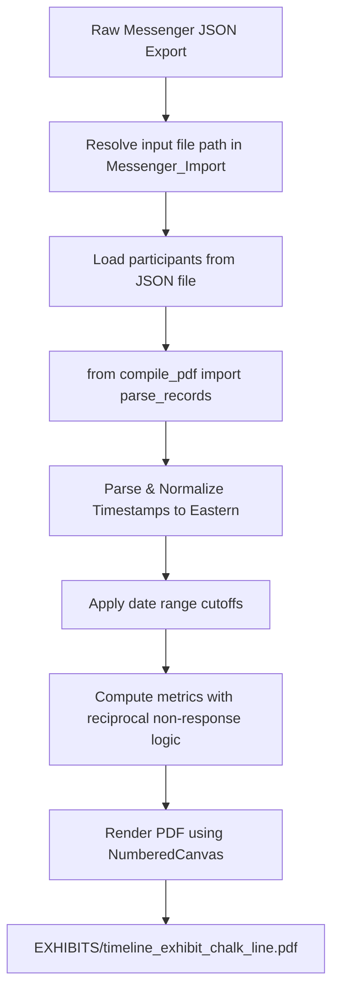

# Technical Specifications & Layout Framework: compile_chalk_line.py

`compile_chalk_line.py` is the standalone zero-grid presentation generator of the Messenger forensic exhibit suite. It compiles unified data layers into a high-contrast centerline timeline exhibit (`EXHIBITS/timeline_exhibit_chalk_line.pdf`) optimized for high-density legal and courtroom presentation.

## 1. Architectural Highlights

- **Layout Standard**: Aligns with the centerline layout and metrics logic framework.
- **Standalone Operation**: Directly inherits the ingestion engine from the baseline utility (`from compile_pdf import parse_records`) but encapsulates all ReportLab layout styling, canvas building, and CLI parameters locally.
- **Path Isolation**: Resolves relative input JSON file names and the call annotations manifest (`call_annotations.csv`) against `Messenger_Import/`, and retrieves video thumbnails and images from the volatile cache `EXHIBITS/media/`. Writes the final PDF directly to the `EXHIBITS/` folder.
- **PII-Free Execution**: No names are hardcoded. Relies exclusively on `--left-party` and `--right-party` CLI parameters, with an elegant dynamic participant auto-detection fallback from the target JSON file.
- **Reciprocal Unanswered Call Attribution**: Re-allocates unanswered video calls to the recipient (the party who missed the call) rather than the initiator.
- **3-Column Summary Stats**: Builds a high-density executive stats table using a grid layout matching the timeline column widths `[222, 60, 222]` with a blank center visual gap.

---

## 2. Ingestion & Invariant Mapping

The compilation process is executed as follows:



### 2.1 Dynamic Party Name Mapping

To decouple raw data parsing from visual customization, the tool implements a double-layered identity resolution mechanism:

1. **Internal Ingestion Names**: Read directly from the `"participants"` array inside the raw JSON file to match the raw `senderName` fields exactly during ingestion (`parse_left_name` and `parse_right_name`) from `Messenger_Import`.
2. **Visual Presentation Labels**: Handled by `--left-party` and `--right-party` CLI parameters. If these arguments are left as default placeholders (`"LEFT PARTY"` and `"RIGHT PARTY"`), they dynamically fallback to the detected participant names.

This guarantees that the timeline parsing logic is never broken by label adjustments, and allows arbitrary anonymization or courtroom labeling (e.g. `--left-party "PLAINTIFF" --right-party "DEFENDANT"`).

---

## 3. Ingestion & Metric Calculations

Categorical message counts are calculated inside `compute_metrics(records)` using the following rules:

* **Sender-Based Ingestion (Initiator)**:
  * **Text Messages**: Credited strictly to the sender/initiator.
  * **Media Exhibits**: Credited strictly to the sender/initiator.
  * **Connected Video Calls**: Credited strictly to the sender/initiator.
* **Recipient-Based Ingestion (Recipient)**:
  * **Unanswered/Missed Video Calls**: **Reciprocal non-response polarity** is applied.
    * If the unanswered call was initiated by the Left Party (`rec["is_jon"]` is True), the Right Party missed it: increment `right_unanswered`.
    * If the unanswered call was initiated by the Right Party (`rec["is_jon"]` is False), the Left Party missed it: increment `left_unanswered`.
* **Dynamic Date Bounds Extraction**:
  * The compiler dynamically evaluates the sorted records list (`records[-1]` and `records[0]`) to extract the absolute earliest and latest records.
  * These bounds are formatted and drawn in the document subheader as `"Timeline Scope: [Start Date] to [End Date]"`.

---

## 4. Layout & Typography Rules

### 4.1 Page Constraints & Centerline Spine Track

* **Page Size**: US Letter (`612` × `792` pt).
* **Margins**: Left margin `54` pt, Right margin `54` pt, Top/Bottom margins `54` pt.
* **Centerline Spine Widths**: Left Column: `222` pt, Center Gap: `60` pt, Right Column: `222` pt.
* **Center Track Style**: The center gap (`60` pt) is **entirely transparent** and clean of any vertical line shading or container bounding blocks, keeping a clean visual dividing track.

### 4.2 Stats Ledger Design

The top executive statistics panel utilizes a dual-column layout split symmetrically across the centerline gap:

```text
+-----------------------+------------+-----------------------+
|  LEFT PARTY TOTALS    |            |   RIGHT PARTY TOTALS  |
|  Text Messages: X     |            |   Text Messages: Y    |
|  Media Exhibits: X    |  (60 pt    |   Media Exhibits: Y   |
|  Connected Calls: X   |   gap)     |   Connected Calls: Y  |
|  Unanswered Calls: X  |            |   Unanswered Calls: Y |
+-----------------------+------------+-----------------------+
```

* **Grid Geometry**: Set as a ReportLab table with column widths `[222, 60, 222]`.
* **Mirrored Layout Alignment Rules**:
  * Left Party cells (`STYLE_STATS_L`) are right-aligned to push data comparisons inward flush against the center track.
  * Right Party cells (`STYLE_STATS_R`) are left-aligned to push data comparisons inward flush against the center track.
* **Typography**: Clean, uniform styling using Helvetica-Bold for column headers and Helvetica (10pt, leading 14pt) for metric entries.

---

## 5. Execution Reference

```powershell
# Build with mandatory arguments
# Output: EXHIBITS/timeline_exhibit_chalk_line.pdf
python compile_chalk_line.py -f "input_export.json" --left-party "John Doe" --right-party "Jane Doe"

# Specify explicit file inside Messenger_Import/, date cutoffs, and custom visual labels
python compile_chalk_line.py -f "input_export.json" --date-from 2026-05-25 --date-to 2026-05-29 --left-party "JOHN" --right-party "JANE"
```

---

## Directory Layout

```text
messenger-logs/
├── core/
│   ├── __init__.py
│   └── parse_calls.py      # Core Ingestion Engine
├── documentation/
├── EXHIBITS/               # Generated workspace (PDFs, HTML, mirrored media cache)
│   └── media/
│       ├── thumbnails/
│       └── rename_map.json
└── Messenger_Import/       # Pristine, read-only forensic source
    └── media/
    └── input_export.json
```
